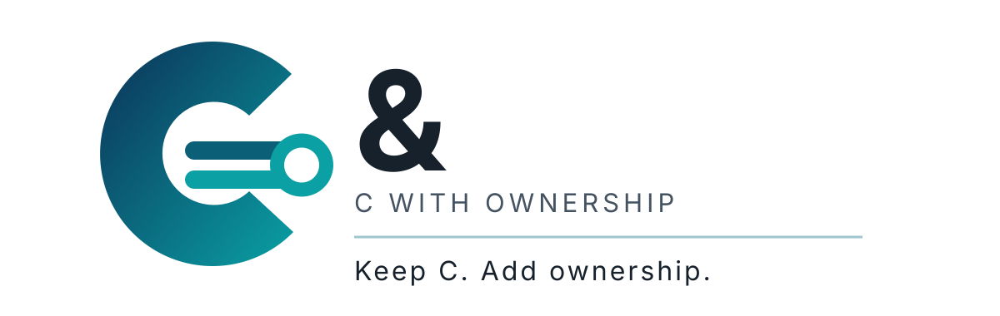
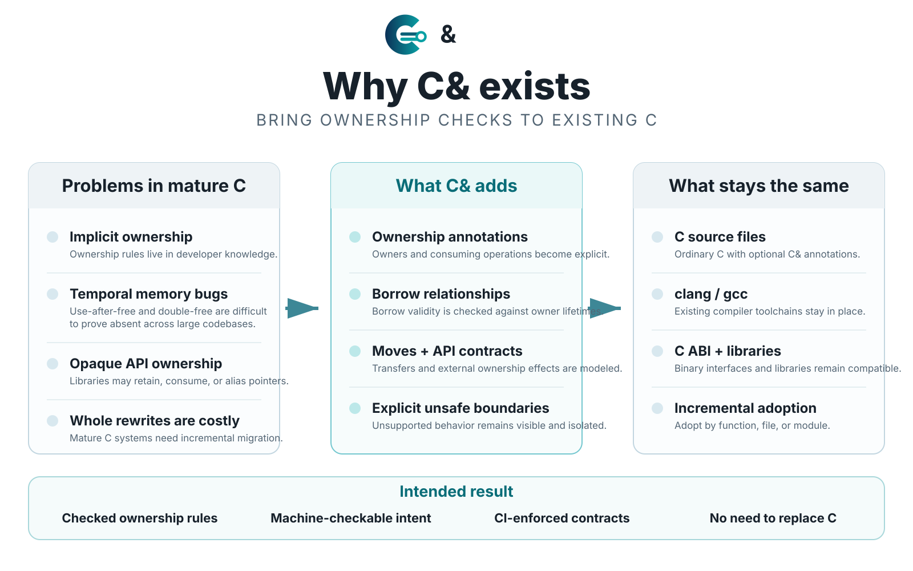
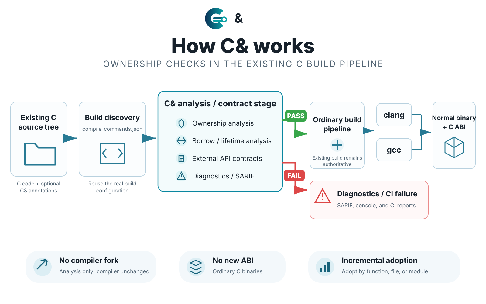

# C& visual identity and project diagrams

The visual identity is intentionally simple: **C& — C with Ownership**.

## Logo

The stylized connector shape is the **C itself**; the adjacent ampersand completes the `C&` wordmark. The connector inside the C represents references, borrowing, and ownership relationships. This avoids the earlier visual ambiguity where a separate C symbol followed by `C&` could read as `CC&`.

## Why C& exists

C& addresses a specific migration problem: mature C systems already have ownership rules, but those rules usually live in developer knowledge and documentation rather than machine-checkable contracts. C& adds ownership annotations, borrow relationships, move/consume semantics, external API contracts, and explicit unsafe boundaries while preserving C source files, existing compiler toolchains, the C ABI, and the library ecosystem.

The diagram deliberately says **“intended result”** rather than claiming that the current 0.1.0 baseline already proves C&1 safety.

## How C& fits into the build pipeline

C& is an analysis and enforcement stage, not a compiler. It consumes the existing build description, analyzes ownership/borrowing semantics and contracts, and either permits the ordinary build to continue or fails with diagnostics. C& does not own machine-code generation and does not define a new ABI.

## Canonical assets

- `docs/assets/cand-logo.svg` — primary project logo;
- `docs/assets/cand-purpose.svg` — project-purpose diagram;
- `docs/assets/cand-pipeline.svg` — build-pipeline architecture diagram.

The SVGs are canonical because they are scalable, editable, diffable, small, and suitable for README, documentation, website, and presentation reuse.
